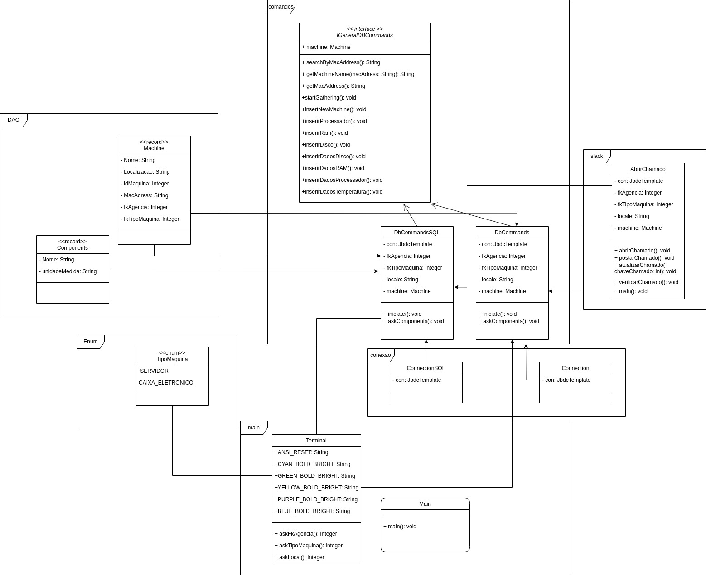

# Desafio de Programação Java: Monitoramento de Sistema com Princípios SOLID 
# by Danielle Munakata e Eduardo Corrêa 

Desafio do Brandão de criação das maquinas e inserção dos registros dos componentes corretos.

# Instruções para execução e teste do Desafio do Java: 
- Baixe o banco e rode ele no MySql, sendo ele o banco  nomeado ‘script-desenvolvimento.sql’ que está na pasta main do repositório;
- Utilizando a IDE IntelliJ IDEA abra o pom.xml e baixe as dependências Maven dele;
- Entre no caminho src/org.example/main e selecione o arquivo Main.java e execute-o;
- Preencha 1 para fkMaquina, escolha se sua máquina é um servidor ou um caixa eletrônico e coloque o CEP da localização da sua máquina e caso a máquina não exista: 
- Informe quais componentes você quer utilizar;
- Para acesso do slack/jira para confirmar a abertura do chamado coloque email: suporte.banksecure@gmail.com senha: B@nk2023, caso não consiga entre em contato com edu.correa1231@gmail.com ou danielle.munakata@sptech.school.

- Diagrama de Classe referente ao desafio: 

- Diagrama de arquitetura técnica: 

